# 💳 Credit Risk Prediction with Explainable AI

Predicting loan default on 307,000 real applications, then turning each decision into the legally-required decline reasons a lender must provide — and auditing those decisions for bias. The original model listed an applicant's **gender as a reason to decline their loan**, an explanation that is unlawful to send under the UK Equality Act and the US Equal Credit Opportunity Act. This project catches that, removes it, and measures exactly what removal does and does not fix.

*Built around honest evaluation: it benchmarks gradient boosting against a transparent baseline, converts model outputs into real adverse action notices, and runs a fairness audit that drives a concrete fix — cutting demographic disparity by 39% at a cost of 0.003 AUC.*

---

## Why This Matters

Credit scoring is one of the most heavily regulated applications of machine learning. In the UK, the **FCA** requires that credit decisions be explainable to consumers, and the **Equality Act 2010** prohibits using sex as a direct input to a lending decision. In the US, the **Equal Credit Opportunity Act** requires lenders to give applicants specific reasons for a decline, and fair-lending law prohibits both direct discrimination and disparate impact via proxies.

A model that is marginally more accurate but uses a protected characteristic is not a better model — it is an illegal one. Every UK fintech and traditional bank runs a credit-risk function under exactly these constraints, which is why explainability and fairness are treated here as the design brief rather than a closing paragraph.

---

## Project Overview

**Objective:** Predict whether a loan applicant will default, and explain every decision in terms a regulator and a consumer would accept.

**Approach:**
- **Baseline:** Logistic Regression (explainable by default)
- **Advanced models:** XGBoost + LightGBM (gradient-boosted trees)
- **Explainability:** SHAP (TreeExplainer) — global importance, dependence, per-applicant waterfalls
- **Adverse action notices:** SHAP contributions converted into ranked decline reasons
- **Fairness evaluation:** selection rate, FPR, FNR by gender and age — followed by remediation

---

## Dataset

**Source:** [Home Credit Default Risk](https://www.kaggle.com/competitions/home-credit-default-risk/data) (Kaggle competition, application data)

- **307,511 loan applications** from Home Credit Group
- **120 features** covering demographics, employment, credit history, and three external credit scores
- **Default rate: 8.1%** (24,825 defaults) — imbalanced but realistic
- Free open-access dataset, an established benchmark for credit-risk ML

---

## Data Exploration

### Target Distribution & Default by Contract Type
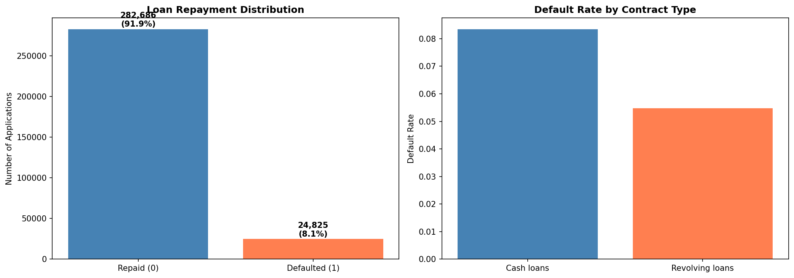

The data reflects real lending outcomes — about **1 in 12** applicants defaulted. This imbalance makes accuracy a useless metric (a model predicting "everyone repays" scores 91.9%), so the project evaluates on AUC-ROC and Average Precision throughout. Cash loans default at a noticeably higher rate than revolving loans.

### Feature Correlations with Default
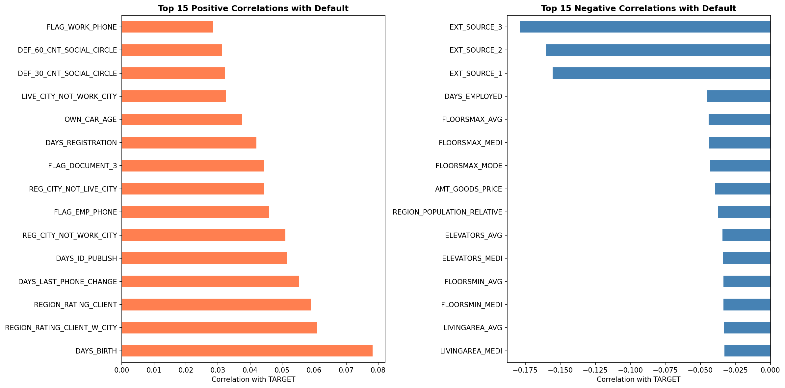

The three external credit scores (`EXT_SOURCE_1/2/3`) show the strongest negative correlation with default — higher external score, lower default risk — while `DAYS_BIRTH` (younger applicants) and region-rating features carry the strongest positive correlation. This early signal, that external scores dominate, holds all the way through to the SHAP analysis, a reassuring sign the model learns genuine creditworthiness rather than noise.

---

## Methodology

### 1. Preprocessing
- **Missing values:** median imputation for numerical features, explicit "Missing" category for categoricals
- **Encoding:** label encoding for categorical features
- **Sensitive attributes:** gender and age held aside for auditing rather than dropped, so the model can be tested against attributes it should not discriminate on

### 2. Train/Test Split
Stratified 80/20 split on the target, preserving the 8.1% default rate in both sets so evaluation reflects real prevalence.

### 3. Class Imbalance Handling
Addressed via `class_weight='balanced'` (LightGBM, Logistic Regression) and `scale_pos_weight` (XGBoost) rather than oversampling. This preserves interpretable, better-calibrated probabilities — which matters when those probabilities become decline explanations.

### 4. Models
- **Logistic Regression** — a transparent baseline that sets the bar the tree models must clear
- **XGBoost** — 500 trees, depth 6, learning rate 0.05
- **LightGBM** — same configuration; selected as champion

Benchmarking the complex models against a genuinely strong linear baseline is the same discipline applied in the sepsis project: never claim a complex model wins until a simple one has had a fair chance.

---

## Results

### Model Comparison

| Model | AUC-ROC | Average Precision |
|---|---|---|
| Logistic Regression | 0.7467 | 0.2264 |
| XGBoost | 0.7589 | 0.2496 |
| **LightGBM (champion)** | **0.7613** | **0.2509** |

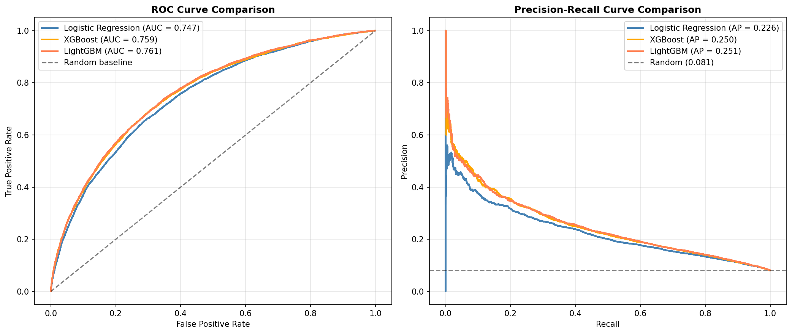

LightGBM won on the full feature set, though the margin over XGBoost is slim (0.0024 AUC). All three clearly beat the no-skill baseline, and the gap between the boosted models and Logistic Regression (~0.015 AUC) is real but modest — a reminder that on clean tabular data a well-regularised linear model remains competitive.

### Confusion Matrix
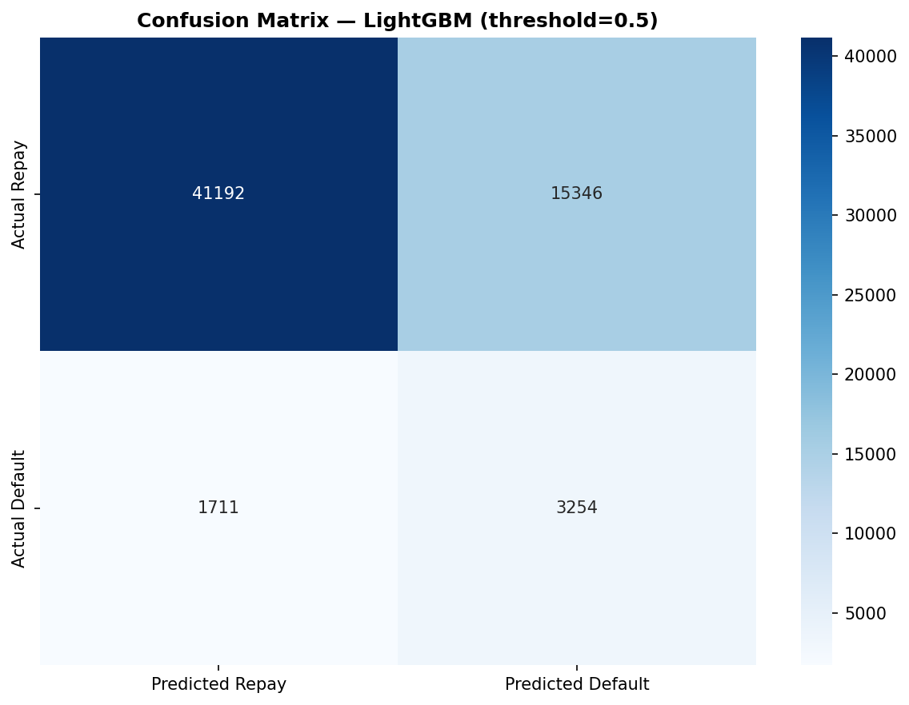

At a 0.5 threshold the champion catches about **two-thirds of true defaulters** (recall 0.66 on the default class) while flagging a large share of good borrowers (precision 0.17). This trade-off is deliberate and adjustable: a false negative (approving a defaulter) is a direct financial loss, while a false positive (declining a good borrower) is forgone revenue. Where the threshold sits is a business decision, not a modelling one, and a cost-sensitive threshold would be tuned to the lender's real loss ratio before deployment.

---

## Explainability

### Global Feature Importance (SHAP)
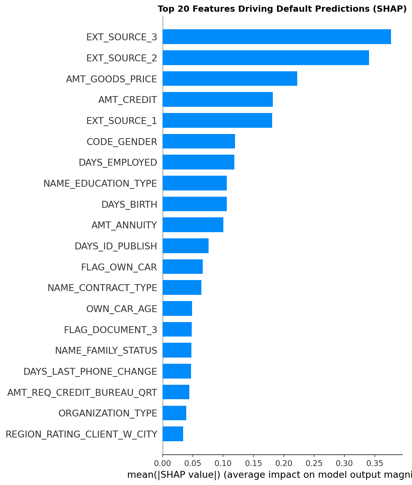

The two strongest external credit scores lead, interleaved with loan and goods amounts (`AMT_GOODS_PRICE`, `AMT_CREDIT`), with `EXT_SOURCE_1` close behind. The prominence of the `EXT_SOURCE` features is exactly what the correlation analysis predicted — the model's primary signal is creditworthiness. Note that `CODE_GENDER` appears as the sixth most important feature: a protected attribute materially influencing predictions. This is precisely the problem the fairness evaluation identifies and removes.

### SHAP Summary — Feature Values vs Impact
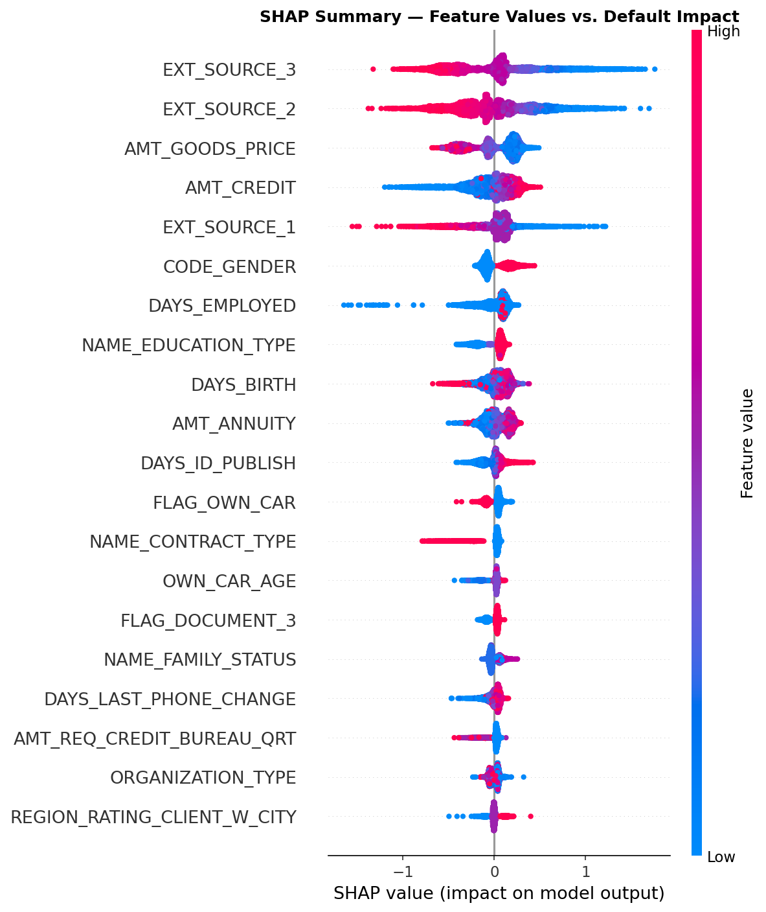

The beeswarm confirms direction: high external-score values (red) push predictions toward "repay" (negative SHAP), low values push toward "default". This is the monotonic, sensible behaviour a fair-lending reviewer would want to see.

### Dependence Plots
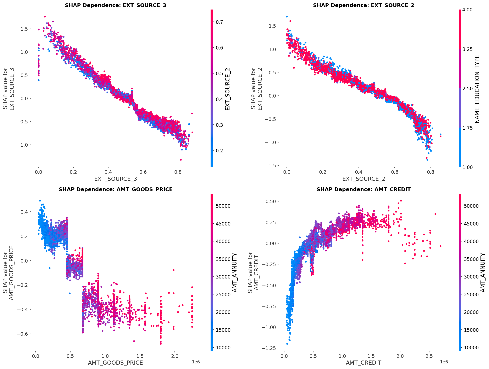

The dependence plots show clean monotonic relationships for the external scores and reveal an interaction between loan amount and annuity — larger loans push risk up, but the effect is modulated by the repayment burden.

### Individual Explanations & Adverse Action Notices

Each decline is converted into the ranked reasons a lender is legally required to provide. The three highest-risk applicants below reach almost identical default probabilities — yet the waterfall plots show they get there by **different feature routes**. This is the core reason SHAP matters for lending: two applicants can share a score while the *explanation* owed to each is entirely different.

**Applicant #1 — 92.50% default probability**
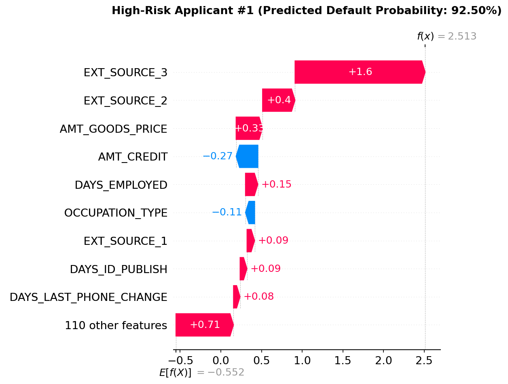

```
Top reasons for decline:
  - EXT_SOURCE_3: 0.03 (SHAP contribution: +1.6005)
  - EXT_SOURCE_2: 0.28 (SHAP contribution: +0.3994)
  - AMT_GOODS_PRICE: 157500.00 (SHAP contribution: +0.3254)
  - DAYS_EMPLOYED: -263.00 (SHAP contribution: +0.1528)
  - EXT_SOURCE_1: 0.51 (SHAP contribution: +0.0937)
```

Here a single very low external score (`EXT_SOURCE_3` = 0.03) dominates, contributing +1.60 on its own — most of the risk comes from one feature.

**Applicant #2 — 91.30% default probability**
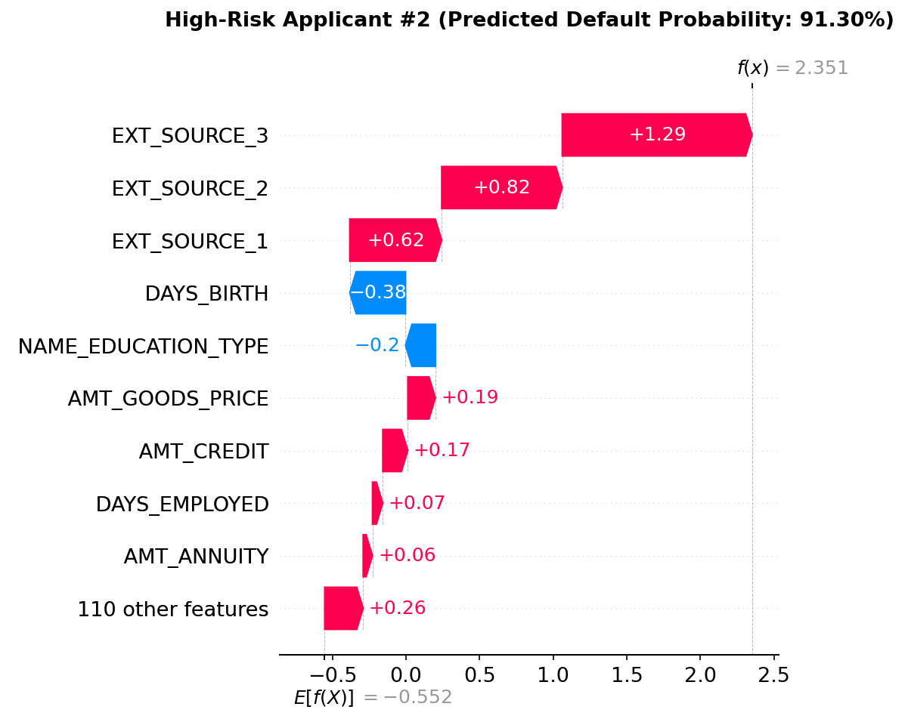

```
Top reasons for decline:
  - EXT_SOURCE_3: 0.04 (SHAP contribution: +1.2897)
  - EXT_SOURCE_2: 0.05 (SHAP contribution: +0.8187)
  - EXT_SOURCE_1: 0.09 (SHAP contribution: +0.6245)
  - AMT_GOODS_PRICE: 450000.00 (SHAP contribution: +0.1872)
  - AMT_CREDIT: 545040.00 (SHAP contribution: +0.1703)
```

This applicant lands at almost the same probability, but the risk is spread across **all three** external scores (each low), not concentrated in one — a different profile entirely despite the near-identical score.

**Applicant #3 — 90.61% default probability**
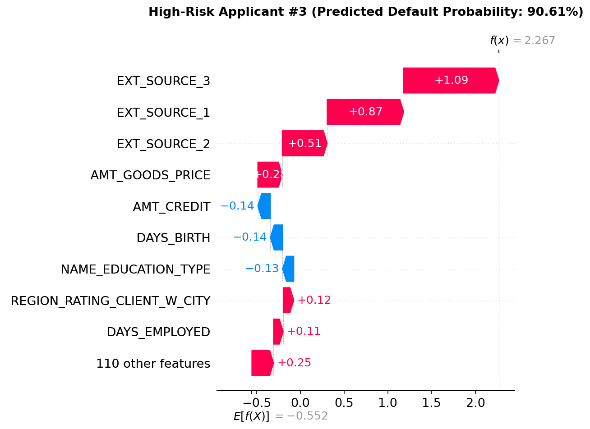

```
Top reasons for decline:
  - EXT_SOURCE_3: 0.12 (SHAP contribution: +1.0857)
  - EXT_SOURCE_1: 0.06 (SHAP contribution: +0.8737)
  - EXT_SOURCE_2: 0.20 (SHAP contribution: +0.5127)
  - AMT_GOODS_PRICE: 225000.00 (SHAP contribution: +0.2795)
  - REGION_RATING_CLIENT_W_CITY: 3.00 (SHAP contribution: +0.1203)
```

A third route to the same outcome: here `EXT_SOURCE_1` is the second-largest driver (unlike the other two), and a region-rating feature enters the top five. Same risk band, different explanation — and critically, **every reason listed across all three is a lawful basis for a credit decision**. That was not true of the original model, as the fairness evaluation shows.

---

## Fairness Evaluation

This is the section most credit-risk portfolio projects skip, and it is where the project earns its keep.

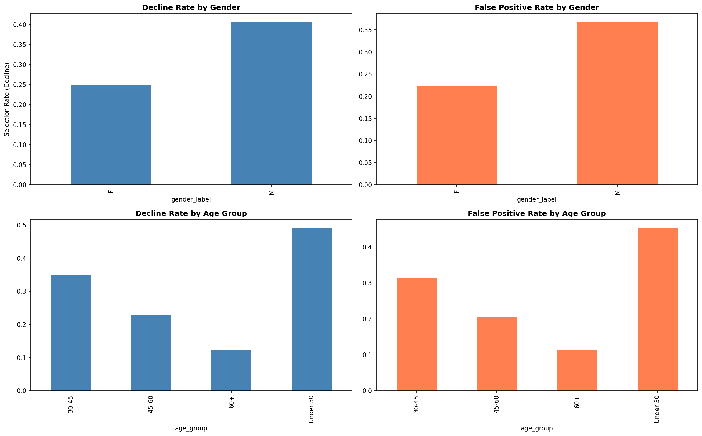

### Gender: a protected attribute in the decline notices

Auditing the original model by sex (excluding the `XNA` group — only ~4 records, too few for a meaningful rate):

| Group | Decline rate | False positive rate | False negative rate |
|---|---|---|---|
| Female | 0.248 | 0.223 | 0.414 |
| Male | 0.407 | 0.368 | 0.252 |

Men were declined far more often than women, and good male borrowers were wrongly declined more often. The decline-rate ratio (F/M = **0.61**) falls below the **0.80 four-fifths threshold**, formally flagging a disparity.

**The cause was direct.** `CODE_GENDER` was the sixth most important feature by SHAP, and it appeared *inside an applicant's decline notice as a reason for the decline*. Under the Equality Act and ECOA, that explanation cannot lawfully be sent. So gender was removed from the model and the champion retrained.

| LightGBM | AUC-ROC | Avg Precision | Demographic Parity Diff | Equalised Odds Diff |
|---|---|---|---|---|
| With `CODE_GENDER` | 0.7613 | 0.2509 | 0.1586 | 0.1617 |
| Without `CODE_GENDER` | 0.7583 | 0.2487 | **0.0975** | **0.0983** |

Removing the protected attribute cost **0.003 AUC** and cut both fairness gaps by roughly **39%**. The gender-free model is the final deliverable, and its decline notices are lawful to send.

**Important honest observation:** the gap shrank but did not close. A 0.0975 parity difference remains with gender *fully removed from training*. That residual is carried by proxy variables correlated with gender — income, car-ownership age, employment length, occupation. Deleting the protected column is necessary but not sufficient, because the model reconstructs part of the signal from proxies. This is the central lesson of fair-lending ML and the reason regulators scrutinise disparate impact, not just direct use. Closing it further requires proxy-aware methods.

### Age: a different problem, handled differently

| Age band | Decline rate | False positive rate | False negative rate |
|---|---|---|---|
| Under 30 | 0.492 | 0.454 | 0.209 |
| 30–45 | 0.349 | 0.314 | 0.291 |
| 45–60 | 0.228 | 0.204 | 0.447 |
| 60+ | 0.124 | 0.112 | 0.644 |

The age gradient is steeper than gender (four-fifths ratio 0.25), but age is not gender. It is legitimately predictive of credit risk, and the false-negative pattern shows why blindly removing it would be wrong: the model rarely misses a risky young applicant (FNR 0.209) but frequently misses a risky older one (FNR 0.644). Dropping age would blind the model to genuine risk. The defensible response is to keep it, monitor the disparity, and be explicit about the tension. **Remove gender, monitor age** — the two protected attributes need different answers, and treating them identically would itself be a mistake.

---

## Key Findings

1. **LightGBM won but the margin was slim** — 0.7613 AUC versus XGBoost's 0.7589 — and the boosted models beat the Logistic Regression baseline by only ~0.015, a reminder to always benchmark against a strong simple model
2. **External credit scores drive predictions** — consistent from correlation analysis through SHAP — confirming the model relies on creditworthiness for its core signal
3. **A protected attribute was influencing decisions** and appearing in decline notices; removing it cost 0.003 AUC and cut fairness disparity by ~39%
4. **Removal alone left a residual disparity carried by proxies** — the often-missed lesson that deleting the protected column does not eliminate proxy bias
5. **Age disparity is larger but partly legitimate** — it is monitored and documented rather than removed, because age genuinely predicts credit risk

---

## Limitations

- **Overreliance on external scores:** `EXT_SOURCE_1/2/3` dominate so heavily that the model is effectively a wrapper around opaque third-party credit scores whose own construction cannot be audited here
- **Application data only:** the bureau, previous-application, and instalment tables were not joined in — the single largest available accuracy gain, and how Kaggle leaders reach ~0.80
- **Proxy bias remains:** the residual 0.0975 parity difference after gender removal is unaddressed and would need proxy-aware mitigation
- **Single threshold:** decisions use 0.5; a cost-sensitive threshold reflecting the real asymmetry between a default loss and a lost customer would be more realistic
- **No probability calibration:** SHAP explanations assume the model's probabilities are meaningful, but calibration was not formally assessed
- **Age fairness is monitored, not resolved:** the tension between age as legitimate risk signal and age as a protected characteristic is documented but not mitigated

---

## Future Improvements

- Join the bureau and previous-application tables for a meaningful AUC gain
- Apply proxy-aware fairness mitigation (in-training fairness constraints or per-group threshold adjustment) and re-measure the residual disparity
- Add probability calibration (Platt scaling or isotonic regression) and a cost-sensitive decision threshold tied to the lender's real loss ratio
- Retrain XGBoost without gender as well, for a fully like-for-like post-removal comparison
- Deploy as a Streamlit app that generates an adverse action notice for any applicant

---

## 📓 View Notebook

[Click here to view the full notebook] https://nbviewer.org/github/TochiOkafor/credit-risk-explainable-ai/blob/main/notebooks/credit-risk-analysis.ipynb

---

## How to Run

1. Download the Home Credit Default Risk dataset from https://www.kaggle.com/competitions/home-credit-default-risk/data (free with a Kaggle account)
2. Open `notebooks/credit-risk-analysis.ipynb` in Kaggle Notebooks or Google Colab
3. CPU is sufficient — no GPU required for tabular ML
4. Add the competition dataset as input, then run all cells sequentially
5. Model selection runs on the full feature set; the compliance retrain drops `CODE_GENDER` and regenerates the SHAP explanations and fairness metrics

**Dependencies:**

- pandas
- numpy
- matplotlib
- seaborn
- scikit-learn
- xgboost
- lightgbm
- shap
- fairlearn
- tqdm

---

## Tools & Libraries


